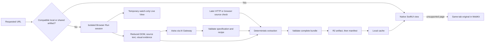

# AstraBrowse planning

**Source of truth · September 8, 2026 · Workers Paid active; fresh IANA/Wikipedia conversions verified; finance changing-content acceptance remains open**

AstraBrowse turns public websites into native macOS interfaces. Astra generates a reusable UI specification and extraction recipe; deterministic extraction supplies separate source content. Compatible public artifacts are shared through a hosted backend and cached locally. Native views provide fast reopening, system appearance, accessibility, and an update experience that preserves reading position.

> **Current execution boundary:** Peter approved the listed Cloudflare resources/configuration, production deployment, one bounded live conversion, and one revalidation at approximately 4:40 p.m. Pacific. That approval remains in force while the integration is completed. Pete subsequently approved reliability deployments and the Workers Paid upgrade, completed checkout himself, and Cloudflare confirmed the subscription active at $5/month plus usage. Local implementation and verification continue in parallel. Additional resource/configuration changes or operations beyond the approved scope require separate confirmation. Keep credentials server-side and preserve the cloud-disabled local environment. See the [activation record](docs/cloud-change-proposal.md).

## Current state and delivery constraints

| Item | Confirmed state |
| --- | --- |
| Native shell | SwiftUI macOS app scaffolded, built, launched, and visually checked. New Tab, sidebar tabs, address entry, and Command-T/Command-L work. Pinned A2UI-Swift integration, the client protocol/cache/update lifecycle, and original-page WebKit support build successfully. A local fixture rendered 20 extracted finance rows; native filtering was verified. Offline reopening, pending-update deferral, application at the top, tab scroll restoration, and the real original-site fallback were verified in the running app. See [local verification](docs/local-verification.md). |
| Git | Canonical repository: [peteallport/Astra-Browser-MacOS](https://github.com/peteallport/Astra-Browser-MacOS), branch `main`. The integration retains the original Xcode-only commit `11645e1` and infrastructure/planning commit `518bee0` with their history, preserving the existing project commits. |
| Production infrastructure | Approved Worker deployed at [astrabrowse-backend.quirk.workers.dev](https://astrabrowse-backend.quirk.workers.dev), latest version `e031dfdb-bac7-4b53-bb12-98cf4c09f0a4`. Workers Paid is active after Pete completed the approved checkout. Private R2 bucket `astrabrowse-artifacts` was created. Production includes `AI`, `BROWSER`, `ARTIFACTS`, and `RESOLVE_RATE_LIMITER`, with `CLOUD_EXECUTION_APPROVED=true`; top-level local configuration stays `false`. |
| Infrastructure verification | The reliability patch passes TypeScript checking, 44 backend/translation tests (including local workerd), Swift protocol checks, and production dry-run bundling. The patch is deployed with unchanged bindings and credentials. The earlier Free-plan HTTP 429 checkpoint is historical; a post-upgrade IANA cold conversion passed, including exact manifest/artifact/provenance validation. Default local Worker GET/HEAD health, finance HTML, and gated resolve checks passed. The separate fixture server exercises the actual native protocol. Health conservatively reports `ready: false`; successful resource deployment does not imply a successful conversion. |
| Runtime integrations | Finance/HN shared-cache bundles pass validation. A fresh Wikipedia Web browser request completed in 42.7 seconds on September 8 at about 6:22 p.m. Pacific; its Astra provenance/revision validated and the macOS app rendered it. The earlier IANA failure and finance expected-change assertion are not resolved by that success. The deployed fix passes terminal-stream and shared-cache verification. After the approved Paid upgrade, a cold IANA reserved-domains request reached validation at 30.46 seconds and then ready, with temporary Live View observed and published artifact checks passing. The original cause of every historical EOF is not established. |
| Service access | Fresh Wikipedia capture and compilation verified current access to Browser Run and `gpt-6-astra` through the deployed gateway. The earlier duplicate `default` secret issue is historical evidence, not grounds to delete credentials. The existing Worker code was redeployed with unchanged bindings and credentials. Pete completed the approved Workers Paid checkout, and the dashboard confirmed purchase complete and the subscription active at $5/month plus usage. |
| Distribution | Hosted backend by default. Reviewers may download the source and run the build script without an Apple Developer membership. Notarization is optional and must not block the demo. |
| License | Peter selected Apache-2.0 for client and backend. Preserve dependency notices and distinguish application code licensing from source website content. |
| Deadline | September 8, 5:30 p.m. Pacific; reserve at least 5:00–5:30 for demo preparation. The prior feature targets were 3:45 first transformation, 4:15 update demonstration, and 4:45 freeze. Local implementation resumed before 4:00 p.m.; target local integration by 4:20 and keep the 4:45 feature freeze, reducing showcase breadth if needed. |
| Repository publication | The latest remote `main` was merged as `3b4412a`, preserving local work and the remote README introduction/image. Peter explicitly authorized committing and pushing all current work. Repository visibility changes and hackathon submission remain separate; a push does not make the repository public. |
| README provenance | The repository's product vision and participant guide were preserved when the scaffold instructions were integrated. |

## Confirmed product decisions

| Decision | Approved behavior |
| --- | --- |
| Platform | Native SwiftUI macOS app, using the existing shell. No extension or second web renderer today. |
| Hero use case | Public news and reading, with recognizable site branding and native conventions. |
| Generation | Showcase specifications must be generated entirely by Astra. Improve prompts and capture evidence through feedback; do not hand-edit final layouts and call them generated. |
| Model | Astra with `reasoning.effort: "low"` through the automatically authenticated Worker AI binding and verified gateway `astrabrowse-demo-gateway`. The unified `openai/gpt-6-astra` route failed. The provider-native `openai` / `responses` request through `env.AI.gateway(id).run(...)` is verified by fresh Wikipedia and IANA conversions; no model substitution or new token is proposed. |
| Renderer | Try A2UI-Swift at a pinned revision. Emit the A2UI version/catalog it supports, replacing the earlier custom json-render subset plan. |
| Prepared showcase | Hacker News, Wikipedia's Web browser article, and the Astra launch page first. Public X, WSJ, Reuters, and further sites are stretch coverage. |
| Complete lifecycle | Also attempt an unfamiliar public domain live. Retain a clearly labeled recording of a real successful conversion as backup. Never substitute another page's replay as a successful unfamiliar-URL result. |
| Exploration | Requested page plus at most one related same-origin page, at most eight browser actions, and a 90-second total conversion deadline. One repair is allowed within that deadline. |
| Loading | Native spinner and real stage/action updates, with temporary remote Browser Run Live View. Do not display fabricated progress percentages or hidden model reasoning. |
| Live View control | Watch-only in the app; no user takeover today. |
| Native interactions | Read, select text, follow real links, filter locally, and follow source-provided next-page links. No website write operations or authenticated workflows. |
| Unsupported pages | Explicit Open Original action in the same tab using WKWebView. Inline HTML islands are later work. |
| New content | Download and validate first. Apply immediately if the tab is selected, visible, and at the top; otherwise stage it and show a circular badge. Returning to the top applies it. |
| Inactivity | Can trigger source revalidation; does not independently replace content while the user is reading farther down. |
| Controlled update source | Yehoooo! Finance, a finance-inspired webpage with clearly labeled simulated quotes changing every 30 seconds. It uses the same real capture/extraction/validation path as other sites. |
| Self-hosting | Reproducible Cloudflare setup today, with generic resource descriptions and replaceable interfaces. Other cloud/local adapters are not claimed to work until implemented and exercised. |
| Personalization | Prompt Astra to change the native UI on the fly is explicitly a stretch goal and may require a follow-up beyond today's build window. |

## Intended benefits and accurate claims

- **Memory efficiency:** native reading views retain compact data and bounded assets instead of a permanent source-site runtime per tab. Cloud browser work is shifted resource use, potentially amortized across users; it is not eliminated globally.
- **Native UX:** semantic typography, keyboard interaction, text selection, accessibility, system light/dark mode, and responsive controls. Native components help, but generated composition still needs runtime checks.
- **No refresh-button workflow:** automatic acquisition and delivery keep the latest successfully acquired content ready. New content does not replace a page while the user reads farther down.
- **Fast opening:** compatible local artifacts render immediately; shared-cache and full cold-generation paths have distinct network/model costs.

Peter's observation of roughly 500 MB for an open x.com tab is a motivation, not a verified average. Measure comparable workloads before claiming a memory saving. JSON size, DOM node counts, JavaScript heap, and total process memory are different measurements. Include relevant WebKit subprocesses and distinguish cold conversion peaks from settled native reading.

“Universal” means public and non-personalized within a declared source variant. It does not mean the source never needs acquisition. Public JavaScript-rendered pages can also be shared; static versus dynamic determines acquisition method, not sharing eligibility. Locale, geography, cookies, experiments, query parameters, and capture profile can change the representation.

## Architecture and artifact boundaries

| Artifact | Responsibility |
| --- | --- |
| UI specification | Native component hierarchy, branding tokens, content bindings, and permitted navigation actions. |
| Extraction recipe | Bounded selectors/readers, repeated groups, stable identity fields, and required-field checks for future source captures. |
| Content snapshot | Actual extracted text, URLs, media references, and stable entity IDs. No invented replacement values. |
| Local view state | Tab selection, scroll state, filter text, and displayed/pending revisions. Never shared as public source content. |
| Personalization overlay — later | Per-user presentation changes against a known base revision, independent of shared source content. |



A cold conversion uses a persistent browser session so real exploration can be watched. Raw HTML and selected source metadata supplement rendered evidence. Subsequent content checks should use ordinary HTTP when sufficient and Browser Run when required. Reuse the recipe without another model call while its required fields remain compatible. A structural fingerprint is supporting evidence, not an excuse to regenerate because an unrelated advertisement changed.

Shared keys include normalized source URL, source-affecting capture variant, and protocol/catalog compatibility. Preserve meaningful query parameters. Use per-page content; share layouts across page families only after validating compatibility. Native appearance and user preferences do not fragment the public source cache.

## Specification choice and alternatives researched

**Latest decision:** Peter selected [A2UI-Swift](https://github.com/BBC6BAE9/a2ui-swift) for a bounded integration trial. This supersedes the earlier custom json-render SwiftUI renderer. The pinned package resolved and compiled. A local protocol fixture now renders repeated native rows, bound source values, and a working local filter through the actual package. Real model-generated specifications still require cloud verification.

Pin commit [`4de8e7f84d716be922866113204fd769162dbcbf`](https://github.com/BBC6BAE9/a2ui-swift/commit/4de8e7f84d716be922866113204fd769162dbcbf) for the trial. Its [manifest](https://github.com/BBC6BAE9/a2ui-swift/blob/4de8e7f84d716be922866113204fd769162dbcbf/Package.swift) targets macOS 14+ and removes the earlier ICU dependency. The current `v0.3.5` prerelease still includes ICU. The resolved JSON Schema dependency requires Swift 6.1, and Swift Collections 1.6.0 raises the actual lockfile floor to Swift 6.2. macOS 14 remains the deployment target, although its scroll-observer fallback has only been compiled, not runtime-tested.

Use `A2UISwiftUI` and `A2UISwiftCore`. The pinned decoder accepts `v0.9` and `v0.9.1`; its encoder emits `v0.9`. Match the compiler schema to that version and the package's actual catalog ID. The [messages](https://github.com/BBC6BAE9/a2ui-swift/blob/4de8e7f84d716be922866113204fd769162dbcbf/Sources/A2UISwiftCore/Schema/ServerToClient.swift) are `createSurface`, `updateComponents`, `updateDataModel`, and `deleteSurface`. Use A2UI path bindings and collection templates, not json-render's `root`/`elements`, `$state`, or `$item` wire format.

The integration path is `SurfaceModel(id:catalog:)` → `SurfaceViewModel(surface:)` → `A2UISurfaceView(viewModel:scrolls:onAction:)`. Construct surfaces with explicit tab-owned IDs and validate incoming surface/catalog IDs. Inspect returned errors: `processMessages` returns `[Error]`, while individual `processMessage` throws. Use `scrolls: false` so AstraBrowse owns scroll position and update eligibility. See the [view-model implementation](https://github.com/BBC6BAE9/a2ui-swift/blob/4de8e7f84d716be922866113204fd769162dbcbf/Sources/A2UISwiftUI/SurfaceViewModel.swift).

The basic catalog has 18 components and no dedicated Link. Route constrained Button actions through browser navigation policy. Array-template identity uses indices, so test a prepended item and reading-position preservation before relying on automatic list updates. Preserve source values, stable content identities, independent recipes/revisions, and app-owned tab/filter state around the library.

The first spike must render one article and repeated list, apply a content-only update, report malformed messages, route a real navigation callback, and check system appearance and scroll preservation. Test fixtures used for this library check are not model-generated showcase artifacts. Actual showcase layouts must still come from Astra.

| Alternative | Current assessment |
| --- | --- |
| [json-render](https://github.com/vercel-labs/json-render) | Earlier selected format; now superseded by the A2UI-Swift trial. Do not implement both renderers in parallel. |
| [Official A2UI](https://a2ui.org/) | Protocol ecosystem; match the community package's pinned version/catalog rather than assuming every current protocol feature is implemented. |
| [DivKit](https://github.com/divkit/divkit) | No direct verified SwiftUI macOS shortcut for this project. |
| Chromium extension | Potential future acquisition bridge for existing sessions; outside the native demo. |
| Hosted web renderer | No second renderer in the core scope. |

The package's root license is MIT and numerous source files retain Google Apache-2.0 headers; preserve the applicable notices when incorporating it. Validate component/reference/binding integrity and source extraction independently; an SDK renderer or schema-valid payload does not establish content fidelity.

## Browser Run, live exploration, and gateway

Cloudflare [Browser Run CDP](https://developers.cloudflare.com/browser-run/cdp/) supports remote browser control. The service name changed, but documented API routes still include `/browser-rendering`. A controlled session, rather than a disposable snapshot request, supports the live exploration experience.

[Live View](https://developers.cloudflare.com/browser-run/features/live-view/) is available through `Cloudflare.getLiveView`, using `mode: "tab"` for the hosted page viewer. The documented viewer is interactive; there is no documented `readOnly` flag. Watch-only therefore means blocking mouse, keyboard, and focus input in AstraBrowse. Keep the signed URL ephemeral, out of public artifacts, recordings of configuration, and logs. Embedding compatibility in WKWebView remains an integration check.

On ready/error/cancel/timeout, close the remote session, remove the temporary viewer, detach handlers, and discard its URL. Hiding WebKit or calling `stopLoading` alone does not prove runtime cleanup.

[Snapshot](https://developers.cloudflare.com/browser-run/quick-actions/snapshot/) can provide rendered content, screenshots, Markdown, and accessibility evidence. Plain fetch and [HTMLRewriter](https://developers.cloudflare.com/workers/runtime-apis/html-rewriter/) can handle suitable HTML refreshes. Do not send huge raw DOM/script payloads to Astra; reduce evidence while preserving useful repeated structures and selector context.

### Selected gateway path: automatic Worker-binding authentication

Peter supplied an account-level endpoint with this shape:

```text
POST https://api.cloudflare.com/client/v4/accounts/{account_id}/ai/v1/responses
```

That route identifies an account, not the created gateway. The actual gateway has now been verified as `astrabrowse-demo-gateway`; the earlier `astrabrowse` placeholder was replaced.

The approved production configuration includes `"ai": {"binding": "AI"}`. Binding requests automatically authenticate within the Worker's account and do not require the earlier `CF_AIG_TOKEN` plan. The first deployed adapter used `env.AI.run(...)`; the correction uses the same binding's provider-native `env.AI.gateway(id).run(...)` method. See [binding methods](https://developers.cloudflare.com/ai-gateway/usage/worker-binding-methods/) and [authentication](https://developers.cloudflare.com/ai-gateway/configuration/authentication/).

Cloudflare documents Responses-style input through `env.AI.run` for a [supported Responses model](https://developers.cloudflare.com/ai/models/openai/gpt-5.6-sol/), but the initial `openai/gpt-6-astra` request failed with HTTP 404 / code `7003`. The deployed provider-native adapter sends provider `openai`, endpoint `responses`, and model `gpt-6-astra` with low reasoning and strict output. Validated generated finance/HN artifacts exist; fresh Wikipedia and post-upgrade IANA conversions subsequently verified model access and publication. Do not silently substitute another model.

Earlier provider-header and outer-header alias attempts returned gateway `2040` requesting `default`. Finance/HN generated artifacts subsequently passed shared-cache validation. Peter then reported a duplicate-secret error after removing the visible `default` entry while its underlying secret remained. No secrets were deleted. The earlier IANA check failed with `CONVERSION_FAILED` before Live View and did not establish provider access at that checkpoint; later fresh Wikipedia and IANA successes supersede that uncertainty. See Cloudflare's [credential precedence](https://developers.cloudflare.com/ai-gateway/features/unified-billing/#credential-precedence). No credential values were inspected during this documentation update.

The [provider-native Responses route](https://developers.cloudflare.com/ai-gateway/usage/providers/openai/) is being used through the automatically authenticated binding; a token-bearing HTTP fallback is not selected. Gateway DLP/guardrail policy can affect streaming; enforce the whole-conversion deadline independently of first-response timeouts. Shared validated artifacts provide reuse; skip model-response caching during deliberately live generation and prompt tuning.

Source pages are untrusted data. Browser tools may inspect, scroll, and open the one permitted related page; source instructions cannot expand the tool scope, request credentials, or override the component catalog. Public acquisition uses clean sessions and never imports the user's signed-in browser state.

## Infrastructure and portable resources

| Resource | Cloudflare implementation | Portable equivalent |
| --- | --- | --- |
| HTTP API and connected progress stream | Worker | HTTP server capable of streaming responses and request cancellation |
| Public browser acquisition | Browser Run/CDP | Isolated Chromium with an authenticated CDP adapter |
| Immutable artifacts and manifests | R2 with conditional writes | Object/file storage supporting conditional manifest publication |
| Model transport | Worker AI binding with selected AI Gateway and verified Astra Responses support | Responses-compatible provider/proxy adapter |
| Request throttling | Worker rate-limit binding | Gateway/server request limiter |
| Local client storage | Application Support JSON and bounded image cache | Platform-native application storage |

Local adapters are implemented, and the listed Cloudflare resources/configuration and bounded live verification have been explicitly approved. Production infrastructure is deployed; fresh Wikipedia and IANA conversions have verified the model route. Hosted finance changing-content acceptance remains unresolved. Changes beyond that approved scope require confirmation. Cloudflare is hosted infrastructure, not something the repository itself self-hosts. Alternative adapters remain unimplemented until separately built and tested.

Storage research resolves the original value-size concern:

- [KV limits](https://developers.cloudflare.com/kv/platform/limits/) allow 25 MiB values; media should remain external. KV's [eventual consistency](https://developers.cloudflare.com/kv/concepts/how-kv-works/) is a larger concern for an immediate update demo than a bounded specification's size.
- [R2 consistency](https://developers.cloudflare.com/r2/reference/consistency/) supports artifact-first publication; avoid stale caching on mutable manifests.
- [D1 limits](https://developers.cloudflare.com/d1/platform/limits/) cap individual strings/BLOBs/rows at 2,000,000 bytes. D1 is not the solution to arbitrarily large JSON values.

Use R2 first; KV, D1, a queue, and a durable-job system are not prerequisites for the first pipeline. A [Cron Trigger](https://developers.cloudflare.com/workers/configuration/cron-triggers/) plus a `scheduled` handler becomes useful when source checks must continue without open clients; configure it only after a bounded source registry and revalidator exist. The current foreground client-triggered plan does not require Cron. A connected Worker request can stream progress; `202 + waitUntil` is not a durable multi-minute job. See [Workers duration limits](https://developers.cloudflare.com/workers/platform/limits/#duration).

### Implemented API contract

| Interface | Contract |
| --- | --- |
| `GET /health` | Implemented features and execution mode. Conservative readiness fields do not claim successful end-to-end generation merely because configuration exists. |
| `POST /resolve` | Public URL to SSE status/live-view events and one terminal ready/error event. A shared hit becomes ready immediately. |
| `POST /pages/{pageKey}/revalidate` | Connected source capture/extraction request, reusing the recipe and honoring the shared freshness interval. |
| `GET /pages/{pageKey}/manifest` | Conditional retrieval of revisions, complete bundle location, and source-check metadata. |
| `GET /artifacts/{revision}` | Immutable complete bundle with distinct spec, recipe, and content objects. |

The bundle carries protocol/catalog version, page key, source URL, capture profile, independent revisions, capture time, and actual model-generation provenance. Hash meaningful normalized content without capture/check timestamps. Store immutable artifacts first; conditionally publish the manifest against its starting ETag so a stale writer cannot replace newer results. Retain the previous complete revision on validation or publication failure.

Network acquisition validates source schemes, credentials/ports, public DNS addresses, redirects, intercepted subrequests, and request/action bounds. Unfamiliar public domains are allowed; do not silently substitute a prepared-domain allowlist. Browser session [hostname guardrails](https://developers.cloudflare.com/api/resources/browser_rendering/subresources/devtools/subresources/browser/methods/create/) can complement interception. They do not establish complete DNS-rebinding protection; stronger filtered/pinned egress is production hardening. Worker rate limits are per location, not a global spending ceiling.

## Local cache, source checks, and visible updates

Store versioned JSON bundles and tab state under Application Support using atomic replacement. Bound image storage and downsample images. Media stays in referenced assets, not base64 inside the specification. Blob URLs, expiring signed URLs, complex media, editors, and sign-in remain original-page concerns.

While the app is active, poll manifests every 15 seconds. Revalidate eligible open pages approximately every 60 seconds, prioritizing the selected tab and serializing expensive acquisition. Reuse recent shared source checks and skip overlapping requests. Pause periodic work when inactive; catch up on return. This is automatic client-triggered revalidation, not guaranteed server push or globally exactly-once acquisition.

| Event | Visible behavior |
| --- | --- |
| Cached tab selected | Show last good native content immediately and check freshness in the background. |
| Validated update; active visible tab at top | Apply immediately, retaining local filter state. |
| Validated update; tab inactive or reader below top | Store latest compatible pending revision and show its circular badge. |
| Reader returns to top | Apply latest pending bundle atomically and clear the badge after success. |
| Unchanged source | Update successful-check metadata without a new content badge. |
| Navigation changed during a request | Discard results for the old navigation generation. |
| Offline/error/incompatible bundle | Keep the last good view and show an accurate stale/error state with retry or Open Original. |

Keep displayed, pending, and last-seen revisions separate. Recheck tab selection/visibility/scroll eligibility when validation completes. Coalesce updates, preserve reading state, and avoid refresh loops. A layout-only revision is not unread content.

## Showcase and acceptance

| Source | Evidence already gathered | Intended demonstration |
| --- | --- | --- |
| [Hacker News](https://news.ycombinator.com/) | Hosted shared-cache resolution returned a valid `gpt-6-astra` bundle; generation recorded at `2026-09-09T00:18:56.302Z`. Earlier raw-source inspection found 30 story rows. | Feed, filtering, real links. |
| [Wikipedia — Web browser](https://en.wikipedia.org/wiki/Web_browser) | Fresh Astra conversion completed in 42.7 seconds, passed exact artifact/provenance checks, and rendered in the native app. Later shared-cache delivery also passed. | Article typography, sections, text selection. |
| [IANA — IANA-managed Reserved Domains](https://www.iana.org/domains/reserved) | Fresh post-upgrade conversion passed capture, Live View, planning, compilation, and publication; validation stage arrived at 30.46 seconds, followed by ready. Exact manifest/artifact/model checks passed. | Successful unfamiliar public-domain conversion; stage timing is not a full end-to-end benchmark. |
| [Astra launch](https://openai.com/index/gpt-6-astra/) | Exact URL returned official article; raw HTML exceeds the 2 MiB inspection cap. | Branded article and evidence reduction. |
| [Yehoooo! Finance](https://astrabrowse-backend.quirk.workers.dev/demo/finance) | A generated `gpt-6-astra` bundle is verified through shared cache. Its saved checkpoint records generation `2026-09-09T00:14:30.485Z` and capture/check around `00:18:52Z`. A later revalidation advanced the server check time but returned unchanged content, failing the expected-change assertion; the checker aborted before saving that newer checkpoint. The local hand-authored fixture remains labeled. | Controlled source changes every 30 seconds; hosted changing-content acceptance is not yet met. |
| [Public X profile](https://x.com/OpenAI), [WSJ](https://www.wsj.com/), [Reuters](https://www.reuters.com/) | Direct HTTP returned content, but useful capture completeness, article access, and Browser Run repeatability remain unverified. | Stretch coverage; respect login/paywall/source-access boundaries with original-page fallback. |

HTTP success does not prove Browser Run access or native conversion. A headline/teaser is not a full article. Preserve real source links, provenance, and capture timestamps.

Acceptance checks:

- Three prepared specifications generated through real Astra calls, plus one real unfamiliar-domain attempt with visible browser exploration.
- Source text/URLs match extracted content; no invented values or hand-authored showcase layouts represented as model output.
- Warm and offline reopening; clean local-cache reuse of a shared artifact without another model/browser call.
- Finance content changes with unchanged spec/recipe revisions; badge while below the top and automatic application at the top.
- Real links, next-page navigation where available, local filtering, keyboard interaction, native appearance, and original-page fallback.
- Invalid output, timeout, cancellation, stale responses, and network failure retain useful content and release temporary browser resources.
- Actual local source-build instructions work. Numerical speed/memory claims have comparable, repeated measurements with stated process scope.
- Backup recordings and previously generated results are explicitly labeled, with their real source and generation time.

## Implementation lanes and handoffs

The native, translation, and API/storage lanes completed local implementation in parallel with separate file ownership. The root integrates the shared contract in `docs/protocol.md`, the controlled finance source, and verification. The approved cloud deployment is active; the root coordinates bounded live checks while local adapters and labeled fixtures support parallel testing.

| Lane | Handoff |
| --- | --- |
| Backend and generation | [Open in New Task](codex://threads/new?prompt=%F0%9F%8C%8C%20Implement%20the%20AstraBrowse%20backend%20generation%20pipeline%3A%20SSE%20resolve%2C%20bounded%20Browser%20Run%20exploration%20with%20watch-only%20Live%20View%20delivery%2C%20Astra%20low%20through%20the%20Worker%20AI%20binding%20and%20selected%20AI%20Gateway%2C%20diagnosing%20the%20failed%20cold%20conversion%20and%20checking%20current%20credential%20routing%20without%20deleting%20secrets%2C%20strict%20generated%20specs%20plus%20deterministic%20recipes%2C%20R2%20atomic%20publication%2C%20and%20public-target%20validation.%20Verify%20actual%20gateway%2Fbrowser%20requests%2C%20source%20fidelity%2C%20cancellation%2C%20timeouts%2C%20and%20shared-cache%20reuse.%20Work%20from%20the%20root%20of%20a%20checkout%20of%20https%3A%2F%2Fgithub.com%2Fpeteallport%2FAstra-Browser-MacOS.%20Read%20README.md%2C%20planning.md%2C%20docs%2Fcloud-change-proposal.md%2C%20and%20docs%2Flocal-verification.md%20before%20acting.%20Preserve%20the%20merged%20remote%20README%20feature%20lines%20and%20image.%20The%20Worker%20is%20deployed%20at%20https%3A%2F%2Fastrabrowse-backend.quirk.workers.dev%3B%20private%20R2%20astrabrowse-artifacts%20and%20gateway%20astrabrowse-demo-gateway%20exist.%20Finance%20and%20Hacker%20News%20shared-cache%20bundles%20passed%20exact%20gpt-6-astra%20provenance%20and%20hash%20validation.%20The%20earlier%20IANA%20failure%20is%20historical%3A%20fresh%20Wikipedia%20and%20post-upgrade%20IANA%20reserved-domains%20conversions%20verified%20model%20access%20and%20publication.%20Pete%20completed%20the%20approved%20Workers%20Paid%20upgrade%20at%20%245%2Fmonth%20plus%20usage%3B%20the%20existing%20Worker%20was%20redeployed%20with%20unchanged%20code%2C%20bindings%2C%20and%20credentials.%20Finance%20revalidation%20returned%20HTTP%20200%20and%20advanced%20sourceCheckedAt%20but%20changed%3A%20false%20with%20unchanged%20content%20failed%20the%20expected-change%20assertion%3B%20the%20checker%20did%20not%20save%20its%20newer%20check%20time.%20No%20hosted%20changing-content%20demonstration%20is%20verified.%20A%20duplicate%20default%20secret%20remains%20after%20the%20visible%20gateway%20entry%20was%20removed%3B%20no%20secrets%20were%20deleted.%20Preserve%20credentials%20and%20concurrent%20work.%20Peter%20approved%20the%20listed%20cloud%20resources%2Fconfiguration%2C%20deployment%20and%20bounded%20live%20checks%2C%20and%20then%20explicitly%20authorized%20committing%20and%20pushing%20all%20current%20work.%20Preserve%20that%20authorization%3B%20seek%20confirmation%20only%20for%20additional%20operations%20beyond%20its%20scope.%20Keep%20local%20execution%20cloud-disabled%20and%20all%20credentials%20server-side.%20Repository%20visibility%20and%20hackathon%20submission%20remain%20separate%20actions.%20Reassess%20the%20September%208%2C%202026%20submission%20deadline%20and%20prioritize%20truthful%20demo%20evidence.) |
| Native renderer and browsing | [Open in New Task](codex://threads/new?prompt=%F0%9F%8C%8C%20Integrate%20pinned%20A2UI-Swift%20commit%204de8e7f84d716be922866113204fd769162dbcbf%20using%20its%20v0.9%20protocol%20and%20catalog%2C%20then%20implement%20native%20read%2Ffilter%2Fnavigation%20behavior%2C%20with%20recognizable%20branding%2C%20system%20appearance%2C%20and%20same-tab%20WKWebView%20original%20fallback.%20Verify%20against%20actual%20generated%20bundles%2C%20keyboard%20and%20appearance%20workflows%2C%20invalid%20specs%2C%20and%20cleanup%20of%20temporary%20Live%20View.%20Work%20from%20the%20root%20of%20a%20checkout%20of%20https%3A%2F%2Fgithub.com%2Fpeteallport%2FAstra-Browser-MacOS.%20Read%20README.md%2C%20planning.md%2C%20docs%2Fcloud-change-proposal.md%2C%20and%20docs%2Flocal-verification.md%20before%20acting.%20Preserve%20the%20merged%20remote%20README%20feature%20lines%20and%20image.%20The%20Worker%20is%20deployed%20at%20https%3A%2F%2Fastrabrowse-backend.quirk.workers.dev%3B%20private%20R2%20astrabrowse-artifacts%20and%20gateway%20astrabrowse-demo-gateway%20exist.%20Finance%20and%20Hacker%20News%20shared-cache%20bundles%20passed%20exact%20gpt-6-astra%20provenance%20and%20hash%20validation.%20The%20earlier%20IANA%20failure%20is%20historical%3A%20fresh%20Wikipedia%20and%20post-upgrade%20IANA%20reserved-domains%20conversions%20verified%20model%20access%20and%20publication.%20Pete%20completed%20the%20approved%20Workers%20Paid%20upgrade%20at%20%245%2Fmonth%20plus%20usage%3B%20the%20existing%20Worker%20was%20redeployed%20with%20unchanged%20code%2C%20bindings%2C%20and%20credentials.%20Finance%20revalidation%20returned%20HTTP%20200%20and%20advanced%20sourceCheckedAt%20but%20changed%3A%20false%20with%20unchanged%20content%20failed%20the%20expected-change%20assertion%3B%20the%20checker%20did%20not%20save%20its%20newer%20check%20time.%20No%20hosted%20changing-content%20demonstration%20is%20verified.%20A%20duplicate%20default%20secret%20remains%20after%20the%20visible%20gateway%20entry%20was%20removed%3B%20no%20secrets%20were%20deleted.%20Preserve%20credentials%20and%20concurrent%20work.%20Peter%20approved%20the%20listed%20cloud%20resources%2Fconfiguration%2C%20deployment%20and%20bounded%20live%20checks%2C%20and%20then%20explicitly%20authorized%20committing%20and%20pushing%20all%20current%20work.%20Preserve%20that%20authorization%3B%20seek%20confirmation%20only%20for%20additional%20operations%20beyond%20its%20scope.%20Keep%20local%20execution%20cloud-disabled%20and%20all%20credentials%20server-side.%20Repository%20visibility%20and%20hackathon%20submission%20remain%20separate%20actions.%20Reassess%20the%20September%208%2C%202026%20submission%20deadline%20and%20prioritize%20truthful%20demo%20evidence.) |
| Cache and updates | [Open in New Task](codex://threads/new?prompt=%F0%9F%8C%8C%20Implement%20AstraBrowse%20local%20atomic%20artifact%20storage%2C%20separate%20tab%20state%20and%20pending%2Fdisplayed%20revisions%2C%2015-second%20foreground%20manifest%20checks%20and%20bounded%20roughly%2060-second%20source%20revalidation.%20Auto-apply%20on%20the%20active%20visible%20tab%20at%20top%3B%20otherwise%20badge%20and%20defer.%20Verify%20offline%20reuse%2C%20race%20handling%2C%20stable%20reading%20position%2C%20and%20unchanged-spec%20content%20updates.%20Work%20from%20the%20root%20of%20a%20checkout%20of%20https%3A%2F%2Fgithub.com%2Fpeteallport%2FAstra-Browser-MacOS.%20Read%20README.md%2C%20planning.md%2C%20docs%2Fcloud-change-proposal.md%2C%20and%20docs%2Flocal-verification.md%20before%20acting.%20Preserve%20the%20merged%20remote%20README%20feature%20lines%20and%20image.%20The%20Worker%20is%20deployed%20at%20https%3A%2F%2Fastrabrowse-backend.quirk.workers.dev%3B%20private%20R2%20astrabrowse-artifacts%20and%20gateway%20astrabrowse-demo-gateway%20exist.%20Finance%20and%20Hacker%20News%20shared-cache%20bundles%20passed%20exact%20gpt-6-astra%20provenance%20and%20hash%20validation.%20The%20earlier%20IANA%20failure%20is%20historical%3A%20fresh%20Wikipedia%20and%20post-upgrade%20IANA%20reserved-domains%20conversions%20verified%20model%20access%20and%20publication.%20Pete%20completed%20the%20approved%20Workers%20Paid%20upgrade%20at%20%245%2Fmonth%20plus%20usage%3B%20the%20existing%20Worker%20was%20redeployed%20with%20unchanged%20code%2C%20bindings%2C%20and%20credentials.%20Finance%20revalidation%20returned%20HTTP%20200%20and%20advanced%20sourceCheckedAt%20but%20changed%3A%20false%20with%20unchanged%20content%20failed%20the%20expected-change%20assertion%3B%20the%20checker%20did%20not%20save%20its%20newer%20check%20time.%20No%20hosted%20changing-content%20demonstration%20is%20verified.%20A%20duplicate%20default%20secret%20remains%20after%20the%20visible%20gateway%20entry%20was%20removed%3B%20no%20secrets%20were%20deleted.%20Preserve%20credentials%20and%20concurrent%20work.%20Peter%20approved%20the%20listed%20cloud%20resources%2Fconfiguration%2C%20deployment%20and%20bounded%20live%20checks%2C%20and%20then%20explicitly%20authorized%20committing%20and%20pushing%20all%20current%20work.%20Preserve%20that%20authorization%3B%20seek%20confirmation%20only%20for%20additional%20operations%20beyond%20its%20scope.%20Keep%20local%20execution%20cloud-disabled%20and%20all%20credentials%20server-side.%20Repository%20visibility%20and%20hackathon%20submission%20remain%20separate%20actions.%20Reassess%20the%20September%208%2C%202026%20submission%20deadline%20and%20prioritize%20truthful%20demo%20evidence.) |
| Controlled source and demo verification | [Open in New Task](codex://threads/new?prompt=%F0%9F%8C%8C%20Build%20the%20clearly%20labeled%20Yehoooo%21%20Finance%20simulated-quote%20source%20changing%20every%2030%20seconds%2C%20then%20verify%20the%20real%20AstraBrowse%20capture%2Fextraction%2Fvalidation%2Fupdate%20path.%20Prepare%20the%20HN%2C%20Wikipedia%20Web_browser%2C%20and%20official%20Astra%20launch%20showcases%20through%20actual%20Astra%20calls%3B%20verify%20an%20unfamiliar%20public%20domain%20and%20accurately%20labeled%20replay%2C%20source%20build%2C%20and%20any%20numerical%20performance%20claims.%20Work%20from%20the%20root%20of%20a%20checkout%20of%20https%3A%2F%2Fgithub.com%2Fpeteallport%2FAstra-Browser-MacOS.%20Read%20README.md%2C%20planning.md%2C%20docs%2Fcloud-change-proposal.md%2C%20and%20docs%2Flocal-verification.md%20before%20acting.%20Preserve%20the%20merged%20remote%20README%20feature%20lines%20and%20image.%20The%20Worker%20is%20deployed%20at%20https%3A%2F%2Fastrabrowse-backend.quirk.workers.dev%3B%20private%20R2%20astrabrowse-artifacts%20and%20gateway%20astrabrowse-demo-gateway%20exist.%20Finance%20and%20Hacker%20News%20shared-cache%20bundles%20passed%20exact%20gpt-6-astra%20provenance%20and%20hash%20validation.%20The%20earlier%20IANA%20failure%20is%20historical%3A%20fresh%20Wikipedia%20and%20post-upgrade%20IANA%20reserved-domains%20conversions%20verified%20model%20access%20and%20publication.%20Pete%20completed%20the%20approved%20Workers%20Paid%20upgrade%20at%20%245%2Fmonth%20plus%20usage%3B%20the%20existing%20Worker%20was%20redeployed%20with%20unchanged%20code%2C%20bindings%2C%20and%20credentials.%20Finance%20revalidation%20returned%20HTTP%20200%20and%20advanced%20sourceCheckedAt%20but%20changed%3A%20false%20with%20unchanged%20content%20failed%20the%20expected-change%20assertion%3B%20the%20checker%20did%20not%20save%20its%20newer%20check%20time.%20No%20hosted%20changing-content%20demonstration%20is%20verified.%20A%20duplicate%20default%20secret%20remains%20after%20the%20visible%20gateway%20entry%20was%20removed%3B%20no%20secrets%20were%20deleted.%20Preserve%20credentials%20and%20concurrent%20work.%20Peter%20approved%20the%20listed%20cloud%20resources%2Fconfiguration%2C%20deployment%20and%20bounded%20live%20checks%2C%20and%20then%20explicitly%20authorized%20committing%20and%20pushing%20all%20current%20work.%20Preserve%20that%20authorization%3B%20seek%20confirmation%20only%20for%20additional%20operations%20beyond%20its%20scope.%20Keep%20local%20execution%20cloud-disabled%20and%20all%20credentials%20server-side.%20Repository%20visibility%20and%20hackathon%20submission%20remain%20separate%20actions.%20Reassess%20the%20September%208%2C%202026%20submission%20deadline%20and%20prioritize%20truthful%20demo%20evidence.) |

The hosted evidence includes shared-cache delivery of generated finance/HN pages, a fresh Wikipedia conversion rendered natively, and a fresh post-upgrade IANA reserved-domains conversion with exact artifact/provenance validation. Earlier IANA and Free-plan HTTP 429 failures remain in the dated verification history. Finance revalidation still has not produced the expected changed content; keep that acceptance gap visible. Existing authorization remains in force, and no secrets were deleted.

### Personalization — explicit stretch/future follow-up

A user could ask Astra for larger type, a denser feed, fewer images, or different organization. Compile a validated presentation change against the same source content and save a per-user overlay with reset/undo. Do not alter shared source data or run arbitrary generated code. This is not part of the infrastructure scaffold or core build and may need a follow-up beyond today's three-hour window.

## macOS tooling and verification provenance

The native scaffold uses `AstraBrowse.xcodeproj`, a shared scheme, macOS 14+ target, and Swift 6. The existing `script/build_and_run.sh --verify` completed with BUILD SUCCEEDED and a running app; the app window and sidebar selection were visually verified. Subsequent feature builds also passed; the renderer and filter were exercised with the labeled local finance fixture. Generated finance/HN bundles pass hosted shared-cache validation. Separately, a fresh Wikipedia conversion was verified and rendered in the native app; the previously failed OpenAI developer page was also observed recovered in the app, with a 6:51 p.m. capture time. The post-upgrade IANA conversion passed hosted artifact validation; native rendering of that IANA result has not yet been checked.

Build products use temporary DerivedData outside the source checkout. The script supports local ad-hoc signing without a Developer ID certificate. It is also the project Codex Run action. Outgoing network entitlement is now enabled, and local backend delivery was exercised. The native SSE parser has a focused regression check for LF/CRLF/CR event boundaries and UTF-8 framing.

## Maintaining this source of truth

Update confirmed choices in place and remove superseded behavior. Keep planned, implemented, locally verified, and deployed status distinct. README remains the concise entry point. The native/backend implementation was pushed as commit `0437004`; reliability fixes were pushed as `e2e2bbb` and `0ea5690`, with remote README changes preserved by merge `e1b1fb0`. Parallel local implementation and the specifically approved cloud deployment/live verification are authorized. Obtain confirmation for additional operations beyond that scope, and update the verification record only from actual results.


### September 8 reliability follow-up before the Paid upgrade

A fresh Wikipedia conversion completed in 42.7 seconds and rendered in the native app, verifying current Astra access. A separate local workerd reproduction identified owner-request cancellation stranding a shared conversion follower. The prepared fix confines I/O and timers to their owning request, gives followers independent deadlines, emits explicit terminal errors, rejects recognized verification interstitials, bounds browser operations/cleanup, and prevents closed Live View replay. All 44 backend tests, typecheck, production dry-run bundling, Swift stream/protocol checks, and the macOS build pass. The patch is deployed as `41a3af5a-7511-4517-a3d6-62da78708c61`. Wikipedia shared-cache resolution, request IDs, terminal SSE delivery, and published artifact hashes validate live. Retrying the failed OpenAI developer page in the native app now shows a specific Browser Run rate-limit error instead of an unexplained EOF. At this checkpoint the service returned HTTP 429 even on a later retry, and the account dashboard showed Workers Free. The exact cause of every prior intermittent stream EOF is not established. This earlier rollout included no new infrastructure, credential changes, or paid-plan changes; the subsequently approved upgrade is recorded below.

The saved Icon Composer design is already the project's Debug/Release app icon; a fresh build verified its compiled resources and appearance. See [local verification](docs/local-verification.md) for evidence.


### September 8 Workers Paid activation and successful cold conversion

Pete approved Workers Paid at $5/month plus usage and completed checkout himself. Cloudflare confirmed purchase complete and the subscription active. The existing Worker was redeployed as `e031dfdb-bac7-4b53-bb12-98cf4c09f0a4` without changing code, bindings, gateway credentials, or resource names. A fresh [IANA reserved-domains](https://www.iana.org/domains/reserved) request observed temporary Live View, completed browser closure, and reached validation at 30.46 seconds before returning ready. Exact manifest/artifact/hash/model checks passed. The Wikipedia warm path also passed with no browser stage. This supersedes the earlier Free-plan launch-limit blocker for the observed run, while finance changing-content acceptance remains unresolved. See [dated verification evidence](docs/local-verification.md).
