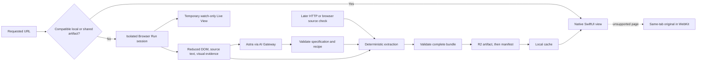

# AstraBrowse planning

**Source of truth · September 8, 2026 · Product plan approved; execution limited to infrastructure and documentation**

AstraBrowse turns public websites into native macOS interfaces. Astra generates a reusable UI specification and extraction recipe; deterministic extraction supplies separate source content. Compatible public artifacts are shared through a hosted backend and cached locally. Native views provide fast reopening, system appearance, accessibility, and an update experience that preserves reading position.

> **Current execution boundary:** Pete paused feature implementation after the infrastructure/documentation scaffold. He subsequently requested that all existing project work be integrated into `/Users/peteallport/Developer/Astra-Browser-MacOS` and pushed to `main`. This integration includes the icon proposals and preserves the original README guide; it does not resume the feature build below.

## Current state and delivery constraints

| Item | Confirmed state |
| --- | --- |
| Native shell | SwiftUI macOS app scaffolded, built, launched, and visually checked. New Tab, sidebar tabs, address entry, and Command-T/Command-L work. Content remains a placeholder. |
| Git | Canonical repository: [peteallport/Astra-Browser-MacOS](https://github.com/peteallport/Astra-Browser-MacOS), branch `main`. The integration retains the original Xcode-only commit `11645e1` and infrastructure/planning commit `518bee0` with their history, preserving the existing project commits. |
| Infrastructure scaffold | Added Worker configuration, Browser Run/R2/rate-limit bindings, gateway configuration placeholders, and an honest `/health` endpoint. The compiler and client integration remain unimplemented. |
| Infrastructure verification | Generated types, TypeScript check, and Wrangler deployment dry run passed. Local GET/HEAD health, missing-route 404, and unsupported-method 405 checks passed. Health reports `ready: false`; the local server was stopped. No cloud resources were created or deployed. |
| Runtime integrations | No website has been converted by AstraBrowse. Browser Run acquisition, Live View embedding, model calls, shared artifacts, native JSON rendering, persistence, and refresh are not implemented. |
| Service access | Pete will configure AI Gateway credentials separately. No successful request through the chosen gateway or working Cloudflare deployment has been established. Missing environment variables in one process do not establish that credentials are absent everywhere. |
| Distribution | Hosted backend by default. Reviewers may download the source and run the build script without an Apple Developer membership. Pete has no active membership; notarization is optional and must not block the demo. |
| License | Pete selected Apache-2.0 for client and backend. Preserve dependency notices and distinguish application code licensing from source website content. |
| Deadline | September 8, 5:30 p.m. Pacific; reserve at least 5:00–5:30 for demo preparation. The prior feature targets were 3:45 first transformation, 4:15 update demonstration, and 4:45 freeze. Reassess remaining time when feature work resumes. |
| Repository publication | GitHub reports the canonical repository is private. Pete authorized pushing existing work to its `main` branch. Repository visibility changes and hackathon submission remain separate; a push does not make the repository public. |
| README provenance | The initial Documents/ChatGPT workspace had no README. The canonical Developer checkout already contained the product vision and participant guide; both were read and preserved when integrating the scaffold instructions. |

## Confirmed product decisions

| Decision | Approved behavior |
| --- | --- |
| Platform | Native SwiftUI macOS app, using the existing shell. No extension or second web renderer today. |
| Hero use case | Public news and reading, with recognizable site branding and native conventions. |
| Generation | Showcase specifications must be generated entirely by Astra. Improve prompts and capture evidence through feedback; do not hand-edit final layouts and call them generated. |
| Model | `gpt-6-astra`, `reasoning.effort: "low"` through Cloudflare AI Gateway's provider-native OpenAI Responses route. “Light” maps to `low`, not a literal API value. |
| Prepared showcase | Hacker News, Wikipedia's Web browser article, and the Astra launch page first. Public X, WSJ, Reuters, and further sites are stretch coverage. |
| Complete lifecycle | Also attempt an unfamiliar public domain live. Retain a clearly labeled recording of a real successful conversion as backup. Never substitute another page's replay as a successful unfamiliar-URL result. |
| Exploration | Requested page plus at most one related same-origin page, at most eight browser actions, and a 90-second total conversion deadline. One repair is allowed within that deadline. |
| Loading | Native spinner and real stage/action updates, with temporary remote Browser Run Live View. Do not display fabricated progress percentages or hidden model reasoning. |
| Live View control | Watch-only in the app; no user takeover today. |
| Native interactions | Read, select text, follow real links, filter locally, and follow source-provided next-page links. No website write operations or authenticated workflows. |
| Unsupported pages | Explicit Open Original action in the same tab using WKWebView. Inline HTML islands are later work. |
| New content | Download and validate first. Apply immediately if the tab is selected, visible, and at the top; otherwise stage it and show a circular badge. Returning to the top applies it. |
| Inactivity | Can trigger source revalidation; does not independently replace content while the user is reading farther down. |
| Controlled update source | Yehoooo! Finance, a finance-inspired webpage with clearly labeled simulated quotes changing every 30 seconds. It uses the same real capture/extraction/validation path as other sites. |
| Self-hosting | Reproducible Cloudflare setup today, with generic resource descriptions and replaceable interfaces. Other cloud/local adapters are not claimed to work until implemented and exercised. |
| Personalization | Prompt Astra to change the native UI on the fly is explicitly a stretch goal and may require a follow-up beyond today's build window. |

## Intended benefits and accurate claims

- **Memory efficiency:** native reading views retain compact data and bounded assets instead of a permanent source-site runtime per tab. Cloud browser work is shifted resource use, potentially amortized across users; it is not eliminated globally.
- **Native UX:** semantic typography, keyboard interaction, text selection, accessibility, system light/dark mode, and responsive controls. Native components help, but generated composition still needs runtime checks.
- **No refresh-button workflow:** automatic acquisition and delivery keep the latest successfully acquired content ready. New content does not replace a page while the user reads farther down.
- **Fast opening:** compatible local artifacts render immediately; shared-cache and full cold-generation paths have distinct network/model costs.

Pete's observation of roughly 500 MB for an open x.com tab is a motivation, not a verified average. Measure comparable workloads before claiming a memory saving. JSON size, DOM node counts, JavaScript heap, and total process memory are different measurements. Include relevant WebKit subprocesses and distinguish cold conversion peaks from settled native reading.

“Universal” means public and non-personalized within a declared source variant. It does not mean the source never needs acquisition. Public JavaScript-rendered pages can also be shared; static versus dynamic determines acquisition method, not sharing eligibility. Locale, geography, cookies, experiments, query parameters, and capture profile can change the representation.

## Architecture and artifact boundaries

| Artifact | Responsibility |
| --- | --- |
| UI specification | Native component hierarchy, branding tokens, content bindings, and permitted navigation actions. |
| Extraction recipe | Bounded selectors/readers, repeated groups, stable identity fields, and required-field checks for future source captures. |
| Content snapshot | Actual extracted text, URLs, media references, and stable entity IDs. No invented replacement values. |
| Local view state | Tab selection, scroll state, filter text, and displayed/pending revisions. Never shared as public source content. |
| Personalization overlay — later | Per-user presentation changes against a known base revision, independent of shared source content. |



A cold conversion uses a persistent browser session so real exploration can be watched. Raw HTML and selected source metadata supplement rendered evidence. Subsequent content checks should use ordinary HTTP when sufficient and Browser Run when required. Reuse the recipe without another model call while its required fields remain compatible. A structural fingerprint is supporting evidence, not an excuse to regenerate because an unrelated advertisement changed.

Shared keys include normalized source URL, source-affecting capture variant, and protocol/catalog compatibility. Preserve meaningful query parameters. Use per-page content; share layouts across page families only after validating compatibility. Native appearance and user preferences do not fragment the public source cache.

## Specification choice and alternatives researched

The linked Vercel project is **json-render**, not `json-reader`.

| Candidate | Research finding | Decision |
| --- | --- | --- |
| [json-render](https://github.com/vercel-labs/json-render) | Catalogs, flat `root`/`elements`, bindings, actions, multiple renderers; Apache-2.0. Its maintained package list does not supply the required SwiftUI macOS renderer. | Use a documented, bounded subset with our own native renderer. Do not claim full compatibility. |
| [A2UI](https://a2ui.org/) | Structure/data separation, streamed updates, catalogs, and actions. Official [renderer matrix](https://a2ui.org/renderers/) lists SwiftUI as planned. | Credible future alternative; no package evaluation in today's implementation path. |
| [A2UI-Swift](https://github.com/BBC6BAE9/a2ui-swift) | Community SwiftUI/AppKit implementation advertised for macOS 14+, with additional dependencies. Not built or verified here. | Do not put an unverified package on the critical path. |
| [DivKit](https://github.com/divkit/divkit) | Server-driven UI for documented iOS, Android, and web clients. | No direct verified SwiftUI macOS shortcut. |
| Chromium extension | Can inspect permitted tabs, but restyling/hiding DOM alone does not remove the original site's runtime. | Later acquisition bridge, especially for existing authenticated sessions. |
| Hosted web renderer | Easiest browser-only judging access, but not proof of native macOS rendering. | No second renderer in the core scope. |

The native catalog is `Column`, `Row`, `Text`, `Image`, `Divider`, `Card`, and `Link`, with repeated collections. Implement the required literal props, `$state`, and `$item` bindings from the [data-binding documentation](https://json-render.dev/docs/data-binding). Browser chrome and local filtering are app-owned. Use semantic roles and small brand/spacing/color token sets, rather than arbitrary CSS.

A strict model-output schema can generate typed element arrays with explicit IDs, then normalize deterministically into the flat renderer map. Validate references, bindings, supported types, graph depth/count, URLs, repeat IDs, and total size. Schema validity alone does not establish correct source extraction. Generated source JavaScript is not an execution interface.

## Browser Run, live exploration, and gateway

Cloudflare [Browser Run CDP](https://developers.cloudflare.com/browser-run/cdp/) supports remote browser control. The service name changed, but documented API routes still include `/browser-rendering`. A controlled session, rather than a disposable snapshot request, supports the live exploration experience.

[Live View](https://developers.cloudflare.com/browser-run/features/live-view/) is available through `Cloudflare.getLiveView`, using `mode: "tab"` for the hosted page viewer. The documented viewer is interactive; there is no documented `readOnly` flag. Watch-only therefore means blocking mouse, keyboard, and focus input in AstraBrowse. Keep the signed URL ephemeral, out of public artifacts, recordings of configuration, and logs. Embedding compatibility in WKWebView remains an integration check.

On ready/error/cancel/timeout, close the remote session, remove the temporary viewer, detach handlers, and discard its URL. Hiding WebKit or calling `stopLoading` alone does not prove runtime cleanup.

[Snapshot](https://developers.cloudflare.com/browser-run/quick-actions/snapshot/) can provide rendered content, screenshots, Markdown, and accessibility evidence. Plain fetch and [HTMLRewriter](https://developers.cloudflare.com/workers/runtime-apis/html-rewriter/) can handle suitable HTML refreshes. Do not send huge raw DOM/script payloads to Astra; reduce evidence while preserving useful repeated structures and selector context.

Use the gateway's documented provider-native endpoint:

```text
POST https://gateway.ai.cloudflare.com/v1/{account_id}/{gateway_id}/openai/responses
```

[Cloudflare's OpenAI provider docs](https://developers.cloudflare.com/ai-gateway/usage/providers/openai/) document that route. [Astra model documentation](https://developers.openai.com/api/docs/models/gpt-6-astra) supports the selected model capabilities. The exact combined browser/tools/structured-output request through Pete's gateway is not yet verified.

For [BYOK](https://developers.cloudflare.com/ai-gateway/configuration/bring-your-own-keys/), the provider key stays in Cloudflare; the Worker uses its gateway authorization secret and optional key alias. The Mac receives only the backend endpoint. Existing gateway DLP/guardrail policies may affect streaming, so verify them during integration. Enforce an overall 90-second run deadline separately from gateway first-response timeouts. Skip model-response caching for deliberately live compilation and prompt tuning; validated shared artifacts provide explicit reuse.

Source pages are untrusted data. Browser tools may inspect, scroll, and open the one permitted related page; source instructions cannot expand the tool scope, request credentials, or override the component catalog. Public acquisition uses clean sessions and never imports the user's signed-in browser state.

## Infrastructure and portable resources

| Resource | Cloudflare implementation | Portable equivalent |
| --- | --- | --- |
| HTTP API and connected progress stream | Worker | HTTP server capable of streaming responses and request cancellation |
| Public browser acquisition | Browser Run/CDP | Isolated Chromium with an authenticated CDP adapter |
| Immutable artifacts and manifests | R2 with conditional writes | Object/file storage supporting conditional manifest publication |
| Model transport | AI Gateway OpenAI Responses passthrough | Responses-compatible provider/proxy adapter |
| Request throttling | Worker rate-limit binding | Gateway/server request limiter |
| Local client storage | Application Support JSON and bounded image cache | Platform-native application storage |

The current task scaffolds these Cloudflare bindings and documents configuration; it does not exercise browser/model/storage operations. Cloudflare is hosted infrastructure, not something the repository itself self-hosts. Alternative adapters remain unimplemented until separately built and tested.

Storage research resolves the original value-size concern:

- [KV limits](https://developers.cloudflare.com/kv/platform/limits/) allow 25 MiB values; media should remain external. KV's [eventual consistency](https://developers.cloudflare.com/kv/concepts/how-kv-works/) is a larger concern for an immediate update demo than a bounded specification's size.
- [R2 consistency](https://developers.cloudflare.com/r2/reference/consistency/) supports artifact-first publication; avoid stale caching on mutable manifests.
- [D1 limits](https://developers.cloudflare.com/d1/platform/limits/) cap individual strings/BLOBs/rows at 2,000,000 bytes. D1 is not the solution to arbitrarily large JSON values.

Use R2 first; add no KV, D1, queue, or durable-job system without a demonstrated need. A connected Worker request can stream progress; `202 + waitUntil` is not a durable multi-minute job. See [Workers duration limits](https://developers.cloudflare.com/workers/platform/limits/#duration).

### Planned API, not implemented by the infrastructure scaffold

| Interface | Contract |
| --- | --- |
| `GET /health` | Infrastructure-only status. Must not claim that bindings, credentials, or upstream integration have been exercised merely because configuration exists. |
| `POST /resolve` | Public URL to SSE status/live-view events and one terminal ready/error event. A shared hit becomes ready immediately. |
| `POST /pages/{pageKey}/revalidate` | Connected source capture/extraction request, reusing the recipe and honoring the shared freshness interval. |
| `GET /pages/{pageKey}/manifest` | Conditional retrieval of revisions, complete bundle location, and source-check metadata. |
| `GET /artifacts/{revision}` | Immutable complete bundle with distinct spec, recipe, and content objects. |

The bundle carries protocol/catalog version, page key, source URL, capture profile, independent revisions, capture time, and actual model-generation provenance. Hash meaningful normalized content without capture/check timestamps. Store immutable artifacts first; conditionally publish the manifest against its starting ETag so a stale writer cannot replace newer results. Retain the previous complete revision on validation or publication failure.

Before adding network acquisition, validate HTTPS targets, credentials/ports, public DNS addresses, redirects, subresources, response type/size, and request/action bounds. Unfamiliar public domains are allowed; do not silently substitute a prepared-domain allowlist. Browser session [hostname guardrails](https://developers.cloudflare.com/api/resources/browser_rendering/subresources/devtools/subresources/browser/methods/create/) can complement interception. They do not establish complete DNS-rebinding protection; stronger filtered/pinned egress is production hardening. Worker rate limits are per location, not a global spending ceiling.

## Local cache, source checks, and visible updates

Store versioned JSON bundles and tab state under Application Support using atomic replacement. Bound image storage and downsample images. Media stays in referenced assets, not base64 inside the specification. Blob URLs, expiring signed URLs, complex media, editors, and sign-in remain original-page concerns.

While the app is active, poll manifests every 15 seconds. Revalidate eligible open pages approximately every 60 seconds, prioritizing the selected tab and serializing expensive acquisition. Reuse recent shared source checks and skip overlapping requests. Pause periodic work when inactive; catch up on return. This is automatic client-triggered revalidation, not guaranteed server push or globally exactly-once acquisition.

| Event | Visible behavior |
| --- | --- |
| Cached tab selected | Show last good native content immediately and check freshness in the background. |
| Validated update; active visible tab at top | Apply immediately, retaining local filter state. |
| Validated update; tab inactive or reader below top | Store latest compatible pending revision and show its circular badge. |
| Reader returns to top | Apply latest pending bundle atomically and clear the badge after success. |
| Unchanged source | Update successful-check metadata without a new content badge. |
| Navigation changed during a request | Discard results for the old navigation generation. |
| Offline/error/incompatible bundle | Keep the last good view and show an accurate stale/error state with retry or Open Original. |

Keep displayed, pending, and last-seen revisions separate. Recheck tab selection/visibility/scroll eligibility when validation completes. Coalesce updates, preserve reading state, and avoid refresh loops. A layout-only revision is not unread content.

## Showcase and acceptance for the later feature build

| Source | Evidence already gathered | Intended demonstration |
| --- | --- | --- |
| [Hacker News](https://news.ycombinator.com/) | Unauthenticated HTTP 200, 30 story rows. Does not use ordinary article headings; repeated-link detection is necessary. | Feed, filtering, real links. |
| [Wikipedia — Web browser](https://en.wikipedia.org/wiki/Web_browser) | Unauthenticated HTTP 200 with article sections and structured metadata. | Article typography, sections, text selection. |
| [Astra launch](https://openai.com/index/gpt-6-astra/) | Exact URL returned official article; raw HTML exceeds the 2 MiB inspection cap. | Branded article and evidence reduction. |
| Yehoooo! Finance | Not built. Model its general finance-page structure on the idea of [Yahoo Finance](https://finance.yahoo.com/); use original demo branding and labeled synthetic quotes. | Controlled source changes every 30 seconds, through real extraction and update delivery. |
| [Public X profile](https://x.com/OpenAI), [WSJ](https://www.wsj.com/), [Reuters](https://www.reuters.com/) | Direct HTTP returned content, but useful capture completeness, article access, and Browser Run repeatability remain unverified. | Stretch coverage; respect login/paywall/source-access boundaries with original-page fallback. |

HTTP success does not prove Browser Run access or native conversion. A headline/teaser is not a full article. Preserve real source links, provenance, and capture timestamps.

Acceptance checks for resumed implementation:

- Three prepared specifications generated through real Astra calls, plus one real unfamiliar-domain attempt with visible browser exploration.
- Source text/URLs match extracted content; no invented values or hand-authored showcase layouts represented as model output.
- Warm and offline reopening; clean local-cache reuse of a shared artifact without another model/browser call.
- Finance content changes with unchanged spec/recipe revisions; badge while below the top and automatic application at the top.
- Real links, next-page navigation where available, local filtering, keyboard interaction, native appearance, and original-page fallback.
- Invalid output, timeout, cancellation, stale responses, and network failure retain useful content and release temporary browser resources.
- Actual local source-build instructions work. Numerical speed/memory claims have comparable, repeated measurements with stated process scope.
- Backup recordings and previously generated results are explicitly labeled, with their real source and generation time.

## Remaining implementation lanes — paused

These lanes describe the approved product, not work to start after the current infrastructure pass. On resumption, establish the shared artifact contract and prove gateway/browser access first, then parallelize by file ownership.

| Lane | Handoff |
| --- | --- |
| Backend and generation | [Open in New Task](codex://threads/new?prompt=%F0%9F%8C%8C%20Implement%20the%20AstraBrowse%20backend%20generation%20pipeline%3A%20SSE%20resolve%2C%20bounded%20Browser%20Run%20exploration%20with%20watch-only%20Live%20View%20delivery%2C%20gpt-6-astra%20low%20through%20AI%20Gateway%2C%20strict%20generated%20specs%20plus%20deterministic%20recipes%2C%20R2%20atomic%20publication%2C%20and%20public-target%20validation.%20Verify%20actual%20gateway%2Fbrowser%20requests%2C%20source%20fidelity%2C%20cancellation%2C%20timeouts%2C%20and%20shared-cache%20reuse.%20Work%20in%20%2FUsers%2Fpeteallport%2FDeveloper%2FAstra-Browser-MacOS.%20First%20read%20README.md%20and%20planning.md%20and%20inspect%20the%20current%20repository%3B%20the%20native%20shell%20and%20infrastructure%20scaffold%20may%20be%20the%20only%20completed%20functionality.%20Pete%20explicitly%20paused%20feature%20implementation%20after%20infrastructure%2Fdocs%2C%20so%20confirm%20the%20new%20task%20instruction%20resumes%20this%20lane.%20Preserve%20concurrent%20work%2C%20keep%20credentials%20server-side%2C%20and%20do%20not%20publish%20or%20submit%20beyond%20current%20authorization.%20Reassess%20the%20September%208%2C%202026%205%3A30%20p.m.%20Pacific%20deadline%20and%20reserve%20at%20least%2030%20minutes%20for%20demo%20preparation.) |
| Native renderer and browsing | [Open in New Task](codex://threads/new?prompt=%F0%9F%8C%8C%20Implement%20the%20AstraBrowse%20SwiftUI%20json-render%20subset%20and%20native%20read%2Ffilter%2Flink%20experience%2C%20with%20recognizable%20branding%2C%20system%20appearance%2C%20and%20same-tab%20WKWebView%20original%20fallback.%20Verify%20against%20actual%20generated%20bundles%2C%20keyboard%20and%20appearance%20workflows%2C%20invalid%20specs%2C%20and%20cleanup%20of%20temporary%20Live%20View.%20Work%20in%20%2FUsers%2Fpeteallport%2FDeveloper%2FAstra-Browser-MacOS.%20First%20read%20README.md%20and%20planning.md%20and%20inspect%20the%20current%20repository%3B%20the%20native%20shell%20and%20infrastructure%20scaffold%20may%20be%20the%20only%20completed%20functionality.%20Pete%20explicitly%20paused%20feature%20implementation%20after%20infrastructure%2Fdocs%2C%20so%20confirm%20the%20new%20task%20instruction%20resumes%20this%20lane.%20Preserve%20concurrent%20work%2C%20keep%20credentials%20server-side%2C%20and%20do%20not%20publish%20or%20submit%20beyond%20current%20authorization.%20Reassess%20the%20September%208%2C%202026%205%3A30%20p.m.%20Pacific%20deadline%20and%20reserve%20at%20least%2030%20minutes%20for%20demo%20preparation.) |
| Cache and updates | [Open in New Task](codex://threads/new?prompt=%F0%9F%8C%8C%20Implement%20AstraBrowse%20local%20atomic%20artifact%20storage%2C%20separate%20tab%20state%20and%20pending%2Fdisplayed%20revisions%2C%2015-second%20foreground%20manifest%20checks%20and%20bounded%20roughly%2060-second%20source%20revalidation.%20Auto-apply%20on%20the%20active%20visible%20tab%20at%20top%3B%20otherwise%20badge%20and%20defer.%20Verify%20offline%20reuse%2C%20race%20handling%2C%20stable%20reading%20position%2C%20and%20unchanged-spec%20content%20updates.%20Work%20in%20%2FUsers%2Fpeteallport%2FDeveloper%2FAstra-Browser-MacOS.%20First%20read%20README.md%20and%20planning.md%20and%20inspect%20the%20current%20repository%3B%20the%20native%20shell%20and%20infrastructure%20scaffold%20may%20be%20the%20only%20completed%20functionality.%20Pete%20explicitly%20paused%20feature%20implementation%20after%20infrastructure%2Fdocs%2C%20so%20confirm%20the%20new%20task%20instruction%20resumes%20this%20lane.%20Preserve%20concurrent%20work%2C%20keep%20credentials%20server-side%2C%20and%20do%20not%20publish%20or%20submit%20beyond%20current%20authorization.%20Reassess%20the%20September%208%2C%202026%205%3A30%20p.m.%20Pacific%20deadline%20and%20reserve%20at%20least%2030%20minutes%20for%20demo%20preparation.) |
| Controlled source and demo verification | [Open in New Task](codex://threads/new?prompt=%F0%9F%8C%8C%20Build%20the%20clearly%20labeled%20Yehoooo%21%20Finance%20simulated-quote%20source%20changing%20every%2030%20seconds%2C%20then%20verify%20the%20real%20AstraBrowse%20capture%2Fextraction%2Fvalidation%2Fupdate%20path.%20Prepare%20the%20HN%2C%20Wikipedia%20Web_browser%2C%20and%20official%20Astra%20launch%20showcases%20through%20actual%20Astra%20calls%3B%20verify%20an%20unfamiliar%20public%20domain%20and%20accurately%20labeled%20replay%2C%20source%20build%2C%20and%20any%20numerical%20performance%20claims.%20Work%20in%20%2FUsers%2Fpeteallport%2FDeveloper%2FAstra-Browser-MacOS.%20First%20read%20README.md%20and%20planning.md%20and%20inspect%20the%20current%20repository%3B%20the%20native%20shell%20and%20infrastructure%20scaffold%20may%20be%20the%20only%20completed%20functionality.%20Pete%20explicitly%20paused%20feature%20implementation%20after%20infrastructure%2Fdocs%2C%20so%20confirm%20the%20new%20task%20instruction%20resumes%20this%20lane.%20Preserve%20concurrent%20work%2C%20keep%20credentials%20server-side%2C%20and%20do%20not%20publish%20or%20submit%20beyond%20current%20authorization.%20Reassess%20the%20September%208%2C%202026%205%3A30%20p.m.%20Pacific%20deadline%20and%20reserve%20at%20least%2030%20minutes%20for%20demo%20preparation.) |

Prioritize a complete transformation and real update cycle over showcase breadth if time becomes constrained. The former 3:45/4:15/4:45 milestones must be reassessed against the remaining deadline; they are not background work authorizations.

### Personalization — explicit stretch/future follow-up

A user could ask Astra for larger type, a denser feed, fewer images, or different organization. Compile a validated presentation change against the same source content and save a per-user overlay with reset/undo. Do not alter shared source data or run arbitrary generated code. This is not part of the infrastructure scaffold or core build and may need a follow-up beyond today's three-hour window.

## macOS tooling and verification provenance

The native scaffold uses `AstraBrowse.xcodeproj`, a shared scheme, macOS 14+ target, and Swift 6. The selected toolchain was Xcode 27.0 beta, build 27A5237l. The existing `script/build_and_run.sh --verify` completed with BUILD SUCCEEDED and a running app; the actual window and sidebar selection were inspected through CUA. This verifies the shell only, not a functioning native website renderer.

Build products use temporary DerivedData because Finder/File Provider metadata inside the synced workspace interfered with signing. The script supports local ad-hoc signing without a Developer ID certificate. It is also the project Codex Run action. Outgoing network entitlement must be added before client networking is implemented; it is not enabled in the original shell.

`xcrun mcpbridge` was found, but the callable tool inventory did not expose the macOS scaffold/build or IDE bridge gateway needed here. Ordinary Xcode tooling successfully scaffolded and built the app. Do not describe unverified headless IDE access as working.

## Maintaining this source of truth

Update confirmed choices in place and remove superseded behavior. Keep planned, implemented, locally verified, and deployed status distinct. README remains the concise entry point. After integrating and pushing the existing work to the canonical repository, stop and wait for Pete's next instruction before implementing the product lanes above.
